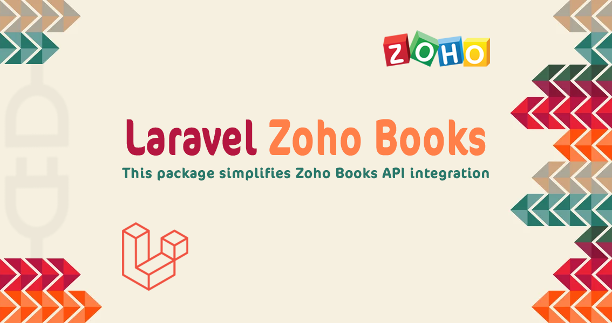

<div align="center">




[English](README.md) | [العربية](README.ar.md)

</div>

<div dir="rtl" align="right">

# لارافيل زوهو المحاسبية

 تقوم هذه الحزمة بتبسيط التكامل مع نظام المحاسبة زوهو بوكس، مما يسهل إدارة التفاعلات مع واجهة برمجة التطبيقات لتبسيط تمرير عمليات المحاسبة.

## المتطلبات

| الاصدار   | البرمجية   |
|:----------|:-----------|
| `^8.2`    | `php`      |
| `^2.4`    | `Composer` |
| `^11.0`   | `Laravel`  |

## الميزات

- [x] نقاط النهاية المصادقة
- [x] نقاط النهاية لجهة الاتصال

<details><summary>الميزات القادمة قريبًا ✨</summary>

- [ ] نقاط النهاية لحساب البنك
- [ ] نقاط النهاية لقواعد البنك
- [ ] نقاط النهاية لمعاملات البنك
- [ ] نقاط النهاية لتعديل العملة الأساسية
- [ ] نقاط النهاية للفواتير
- [ ] نقاط النهاية للمخطط المحاسبي
- [ ] نقاط النهاية لشخص جهة الاتصال
- [ ] نقاط النهاية لمذكرة الائتمان
- [ ] نقاط النهاية للعملة
- [ ] نقاط النهاية للدفع من العميل
- [ ] نقاط النهاية للوحدة المخصصة
- [ ] نقاط النهاية للتقدير
- [ ] نقاط النهاية للنفقات
- [ ] نقاط النهاية للفواتير
- [ ] نقاط النهاية للبند
- [ ] نقاط النهاية للمذكرات المحاسبية
- [ ] نقاط النهاية لرصيد البداية
- [ ] نقاط النهاية للمشروع
- [ ] نقاط النهاية لأمر الشراء
- [ ] نقاط النهاية للفواتير المتكررة
- [ ] نقاط النهاية للنفقات المتكررة
- [ ] نقاط النهاية للفواتير المتكررة
- [ ] نقاط النهاية للفواتير المؤقتة
- [ ] نقاط النهاية لأمر المبيعات
- [ ] نقاط النهاية للمهام
- [ ] نقاط النهاية للضرائب
- [ ] نقاط النهاية لإدخال الوقت
- [ ] نقاط النهاية للمستخدم
- [ ] نقاط النهاية لمذكرة الائتمان من المورد
- [ ] نقاط النهاية لدفع المورد
- [ ] نقاط النهاية لتكامل Zoho CRM

</details>

## التثبيت

قم بتثبيت الحزمة باستخدام Composer:

<div dir="ltr" align="left">

```sh
composer require sumer5020/laravel-zoho-books
```

</div>

## نشر الأصول

نشر جميع الأصول:

<div dir="ltr" align="left">

```sh
php artisan vendor:publish --provider=Sumer5020\ZohoBooks\ZohoBooksServiceProvider
```

</div>

نشر الإعدادات فقط:

<div dir="ltr" align="left">

```sh
php artisan vendor:publish --tag=zohoBooks.config
```

</div>

نشر قواعد البيانات فقط:

<div dir="ltr" align="left">

```sh
php artisan vendor:publish --tag=zohoBooks.migrations

# ترحيل قواعد البيانات
php artisan migrate
```

</div>

أضف التالي إلى ملف .env الخاص بك وأضف بياناتك والتي تم اخذها من `https://accounts.zoho.com/developerconsole`

<div dir="ltr" align="left">

```env
ZOHO_BOOKS_CLIENT_ID=
ZOHO_BOOKS_CLIENT_SECRET=
ZOHO_BOOKS_ACCESS_CODE=
ZOHO_BOOKS_REDIRECT_URI=
```

</div>

بعد ذلك، قم بتشغيل الأمر `php artisan zoho:init` لتفعيل بيانات الاعتماد الخاصة بك وإدخال `token`, `refresh_token`, `expires_in` الى جدول `zoho_tokens`.

> تنبيه: استخدمنا `Self Client` لإنشاء رمز وصول الخادم إلى الخادم. يجب تشغيل الأمر في موجه الاوامر قبل انتهاء صلاحية رمز الوصول.

> ملاحظة: مدة صلاحية `expires_in` هي لـ `token،` بينما `refresh_token` صالح مدى الحياة حتى تقوم بإلغائه.

> ملاحظة: لتقليل عدد الطلبات إلى قاعدة البيانات وتحسين الأداء، يجب عليك تخزين بيانات اعتماد رمز المصادقة مع وقت انتهاء يساوي مدة صلاحية الرمز في التخزين مؤقت.

## الاستخدام

### الإعداد 🚀

بعد نشر الاصول أضف `ZohoBooksFacade` في وحدة التحكم الخاصة بك أو أي فئة تحتاج إلى استخدام وظائف الحزمة بها:

<div dir="ltr" align="left">

```php
use Sumer5020\ZohoBooks\Facades\ZohoBooksFacade;
# أو
use ZohoBooks;
```
</div>

### المصادقة

تحديث رمز الوصول

<div dir="ltr" align="left">

```php
$token = ZohoBooksFacade::authentications()->refreshAccessToken($refresh_token);
```

</div>

إلغاء رمز الوصول

<div dir="ltr" align="left">

```php
$token = ZohoBooksFacade::authentications()->refreshAccessToken($refresh_token);
```

</div>

## الرخصة

رخصة MIT. يرجى الاطلاع على ملف [MIT license](LICENSE.md) لمزيد من المعلومات.

</div>